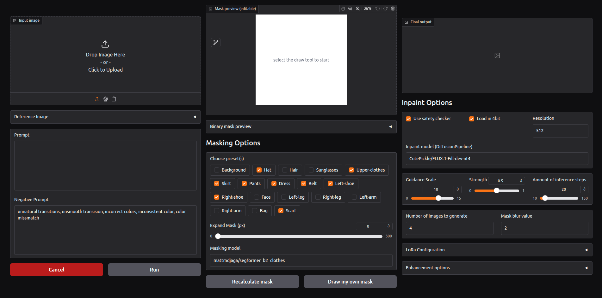

<p align="center">
  
</p>

<h2 align="center">Inpainter</h2>

<p align="center"><b>Inpainter</b> is a python tool that implements a <b>selective image inpainting</b> pipeline. It allows you to modify specific parts of an image, such as clothing, background, or facial features, while preserving natural textures, proportions, and lighting.</p>

<p align="center">
  
</p>

<br>

<p align="center">
  
  
  
</p>

---

<br>

### Table of contents (TOC)
- [What Inpainter provides](#inpainter-provides)

- [Quickstart](#quickstart)
    - [Download](#download)
    - [Setup Environment](#activate-environment)
    - [Start WebUI](#webui)
    - [Desktop App](#desktop-app)
    - [Use PythonAPI](#python-api)

- [Project structure](#project-structure)
- [Parameters](#parameters-and-what-they-do)
- [Resources](#resources)
- [License](#license)

**Inpainter provides:**
- 🖥️ A Gradio web interface for easy experimentation
- 🐍 A Python API for scripted pipelines
- 🔧 A modular model system allowing to swap in any masking, inpainting, or enhancement model

# Quickstart
#### Download
```bash
git clone https://github.com/c4vxl/Inpainter
cd Inpainter
```

#### Activate Environment
##### Linux / Mac
```bash
python -m venv .venv
source .venv/bin/activate
```
##### Windows
```bash
python -m venv .venv
.venv\Scripts\activate
```

#### Install requirements
```
pip install -r requirements.txt
```


Now the environment has been set up and you can use the:

### WebUI

```bash
python src/server.py
```
This launches a local Gradio interface where you can upload an image, apply masks, and run inpainting + enhancement.

### Desktop App

_This WebUI can also be run wrapped in a seperately windowed desktop application. For that just run:_

```bash
python src/app.py
```

<br>

Here's a setup command to install the desktop app on linux:
```sh
bash <(curl -s https://raw.githubusercontent.com/c4vxl/Inpainter/refs/heads/main/setup/app.sh)
```

<br>
<center>or use the</center>
<br>

### Python API
If you want greater control over the inner workings, Inpainter also provides a Python pipeline:
```python
from PIL import Image

from models.mask.SegformerB2Clothes import SegformerB2Clothes
from pipeline.PipeV1 import PipeV1

# Initialize my pipeline
pipeline = PipeV1()

# Load image
image = Image.open("/path/to/my/image").convert("RGB")

# Generate images (default is 4)
images = pipeline(
    image = image,
    prompt = "Do this",
    negative_prompt = "Don't do that",
    mask_labels = SegformerB2Clothes.SHIRT_LABELS,
    mask_expand = 30,
    guidance_scale = 10.,
    strength = 0.97,
    upscale_value = 4,
    fidelity = 0.8,
)

for img in images:
    img.show()
```


# Project structure
*Here are some direct links to the different sections of the Inpainter code base:*
| Component | Description |
| --------- | ----------- |
| [**/models/inpaint**](https://github.com/c4vxl/Inpainter/tree/main/src/models/inpaint/) | Implementations of the core inpainting models. |
| [**/models/mask**](https://github.com/c4vxl/Inpainter/tree/main/src/models/mask/) | Implementations of the masking models. |
| [**/models/enhance**](https://github.com/c4vxl/Inpainter/tree/main/src/models/enhance/) | Implementations of the image enhancement models, |


# Parameters and what they do:
Here's an overview of common parameters and what they are used for.
These parameters are used in both the WebUI and the python API
| Parameter | Description |
|---------|-------------|
| | <center>**Masking Options**</center>
Preset Masks | Select parts of the image to automatically mask (e.g., Hair, Face, Upper-clothes). Multiple selections allowed.
Mask Expansion | Expand the mask by a specified number of pixels to cover more area around the selected region.
Masking Model | The model used to generate masks. Default is a clothing segmentation model but can be replaced with another compatible model.
Draw My Own Mask | Manually paint the area you want to inpaint or modify.
Recalculate Mask | Automatically regenerate the mask based on your selections and settings.
| | <center>**Inpainting Options**</center>
Prompt | Describe what you want the inpainted area to look like (e.g., "red shirt, realistic lighting").
Negative Prompt | Specify what you do **NOT** want in the output (e.g., "blurry, unnatural colors").
Resolution | Output image resolution. Higher resolution = more detail but slower generation.
Inpaint Model | The diffusion model used for inpainting.
Guidance Scale | Controls how strongly the model follows your prompt. Higher = more faithful to prompt, lower = more creative.
Strength | How much the masked region is changed. 0 = no change, 1 = full modification.
Number of Inference Steps | More steps = higher quality, slower generation.
Number of Images per Prompt | How many variations the model will generate for each prompt.
Mask Blur | Softens mask edges for smoother transitions between edited and original areas.
Use Safety Checker | Filters NSFW content.
Load in 4-bit | Reduces GPU memory usage at a minor cost to model precision.
Use strict mask | Forces the model to only edit inside the specified mask. Often yields unrealistic results, only use if necessary.
Strict mask forgiveness | Gives `use_strict_mask` a little head room so that the generated parts blend in with the initial image
LoRa Weights | Add Low rank adaptation modules to the base inpaint model. (Paths can be local paths or huggingface repos)
| | <center>**Enhancement Options**</center> 
Enhance Background | Improves quality and sharpness of non-masked areas.
Face Upsample | Enhances facial detail and clarity.
Draw Box | Adds a bounding box around faces or objects, useful for debugging or inspection.
Has Aligned | Check if the input image is already aligned for face/pose enhancement.
Upscale Value | Multiplier for final image resolution to increase quality.
Fidelity | Balances identity preservation vs. image quality in face enhancements (0 = more quality, 1 = more identity fidelity).

# Resources
- [sczhou/CodeFormer](https://github.com/sczhou/CodeFormer)
- [CutePickle/FLUX.1-Fill-dev-nf4](https://huggingface.co/CutePickle/FLUX.1-Fill-dev-nf4)
- [mattmdjaga/segformer_b2_clothes](https://huggingface.co/mattmdjaga/segformer_b2_clothes)

<br>

> [!IMPORTANT]
> While this application allows for loading all sorts of Hugging Face-compatible models, please adhere to the official requirements and guidelines of the models you use.

<br>

A project by [c4vxl](https://info.c4vxl.de/)